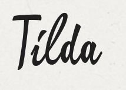

 
Tilda (Transparent Integrated Light Data Architecture) is not an ORM, but an integrated data platform that
takes a base-level view from the database schema level, and projects it in Java and JavaScript in a classic 
3-tier architecture. It provides a JSON-based configuration language to define basic tables/objects, and higher 
level patterns such as Importers, Exporters, Interfaces, History, Mergers etc... It generates code so you don't 
have to write it all and focus on your business logic. 
 
This work is based on ideas and experience gathered over the past 15 years building large data systems and complex
applications, from EJB containers, to Hibernate-based systems, and more recently, a full-fledge real-time clinical
analytics platform. Tilda aims to be as transparent and simple as possible, providing a fairly flat view of your data
and projecting across multiple tiers of your application. For example, the platform only support minimal joins at the 
application level and requires you to define Views in the database, and appropriate indices, to structure your system.
The code generated is human-readable from the get go and is easy toi walk throgh and understand if need be. Tilda
also provides a runtime environment to allow for caching, model introspection etc... 
 
Contrary to ORMs such as Hibernate or myBatis, Tilda takes a decidely database-centric view of the world: we believe
you cannot build a complex large-scale performing data applciation without thinking about it full-stack, and it all 
starts at the database level. Without understanding that level, it's easy to write code and grow your application 
with complete disregard to the performance andscalability constraints of your backend. Simple things are really easy,
and Tilda can model complex data arrangements in a simple manner. But Tilda will definitely get in the way if you
try to do something that doesn't fit the model, for example, execute a complex query witout the proper indices on
the underlying data. 
 
At this time, Tilda only supports Java as a target language, and Postgres 9.x as a target Database. However, the
framework was built to support targetting other languages (such as .Net for example), and other databases (MS SQL Server
is a priority to be built soon, and other databases, including NOSQL backends such as Cassandra and MongoDB are in
the works). Ultimately, we are aiming for an extensible data architecture that woudl enable integration with different
formats, such as CSV, or HL7 (a standard healthcare data exchange format), and other the ability to extend the patterns
supported (for example, automatically generating mini data marts for local reporting needs). 
 
Over the next few months, we will be trying to add more documentation and sample apps, but we are prioritizing work 
that directly affects production-ready features for our own Healthcare data platform currently deployed at several 
customers.
